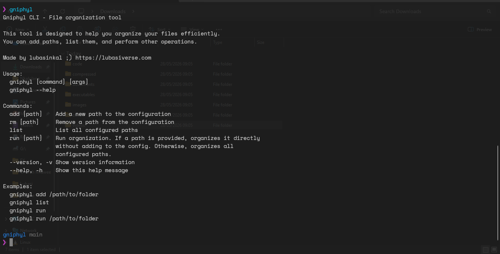

# Gniphyl

[](https://pkg.go.dev/github.com/lubasinkal/gniphyl)
[](https://goreportcard.com/report/github.com/lubasinkal/gniphyl)
[](LICENSE)

**Gniphyl** is a cross-platform CLI tool written in **Go** that organizes files into categorized folders based on their extensions (images, videos, documents, etc.). It uses only the Go standard library -- no external dependencies.

---

Running the tool


Output after **gniphyl run**


---

## Features

- Add, list, and remove directory paths in a configuration file
- Organize files into typed folders (images, videos, documents, compressed, audio, code, executables, others)
- Cross-platform (Windows, macOS, Linux)
- No external dependencies (pure Go standard library)
- Standalone binary, ~3MB

---

## Installation

### Install with Go (recommended)

```bash
go install github.com/lubasinkal/gniphyl/cmd/gniphyl@latest
```

Ensure `$GOPATH/bin` (or `$HOME/go/bin`) is on your PATH.

### Download a release binary

Download the precompiled executable for your platform from the [Releases](https://github.com/lubasinkal/gniphyl/releases) page.

### Build from source

Requires Go 1.21 or later.

```bash
git clone https://github.com/lubasinkal/gniphyl.git
cd gniphyl
go build -o gniphyl ./cmd/gniphyl/
```

Cross-compile for other platforms:

```bash
GOOS=windows GOARCH=amd64 go build -o gniphyl.exe ./cmd/gniphyl/
GOOS=darwin  GOARCH=amd64 go build -o gniphyl      ./cmd/gniphyl/
GOOS=linux   GOARCH=amd64 go build -o gniphyl      ./cmd/gniphyl/
```

### Use as a Go package

```bash
go get github.com/lubasinkal/gniphyl
```

```go
import "github.com/lubasinkal/gniphyl"

func main() {
    err := gniphyl.Organize("/path/to/directory")
    if err != nil {
        log.Fatal(err)
    }
}
```

See [example/main.go](example/main.go) for more usage.

---

## Usage

```bash
# Show help
gniphyl --help

# Show version
gniphyl --version

# Add a directory to the list of managed paths
gniphyl add /path/to/directory

# Remove a path
gniphyl rm /path/to/directory

# List all configured paths
gniphyl list

# Organize all configured paths
gniphyl run

# Organize a single directory without adding it to config
gniphyl run /path/to/directory
```

### Example workflow

```bash
gniphyl add ~/Downloads

gniphyl list
# Configured Paths:
# --------------------------------------------------
# 1. /home/user/Downloads
# --------------------------------------------------

gniphyl run
# Files sorted into:
#   images/      jpg, jpeg, png, gif, bmp, webp
#   videos/      mp4, mkv, webm, flv, avi, mov
#   documents/   pdf, doc, docx, xls, xlsx, ppt, pptx, txt, csv
#   compressed/  zip, rar, tar, gz, 7z
#   executables/ exe, msi
#   audio/       mp3, wav, flac, m4a, aac
#   code/        html, css, js, py, java, c, cpp, h, hpp, php, sql
#   others/      everything else
```

---

## API

All public functions are available when importing the package.

### `Organize(path string) error`

Organizes files in the given directory into categorized subdirectories.

```go
err := gniphyl.Organize("/path/to/directory")
```

If any files fail to move, the returned error is of type `*gniphyl.OrganizeError` containing per-file failure details.

### `LoadExtensionsConfig() (*Config, error)`

Loads the built-in extension-to-category mapping from the embedded `extensions.json`.

### `LoadPathsConfig() (*PathsConfig, error)`

Loads the user's saved directory paths from `~/.config/gniphyl/config.json` (or `%LOCALAPPDATA%\gniphyl\config.json` on Windows). Migrates automatically from the legacy `config.toml`.

### `SavePathsConfig(config *PathsConfig) error`

Saves the user's directory paths to the config file.

### `GetFileCategory(ext string, config *Config) string`

Returns the category name for a file extension (e.g., `".jpg"` -> `"images"`). Unrecognized extensions return `"others"`.

### `GetSupportedCategories(config *Config) []string`

Returns all category names.

### `GetExtensionsForCategory(category string, config *Config) ([]string, error)`

Returns the file extensions belonging to a category.

---

## Configuration

Extension-to-category mappings are defined in [extensions.json](extensions.json). Edit it and rebuild to customize.

Per-user path configuration is stored at:

- **Windows**: `%LOCALAPPDATA%\gniphyl\config.json`
- **Linux / macOS**: `~/.config/gniphyl/config.json`

---

## Technical details

| Attribute | Value |
|---|---|
| Language | Go (stdlib only) |
| Module | `github.com/lubasinkal/gniphyl` |
| Dependencies | None |
| Go version | 1.21+ |
| Binary size | ~3MB |
| Platforms | Windows (amd64, arm64), macOS (amd64, arm64), Linux (amd64, arm64) |
| License | MIT |

---

## Contributing

1. Fork the repo and clone your fork
2. Create a feature branch: `git checkout -b feature/my-feature`
3. Make changes, add tests, run `go test ./...` and `go vet ./...`
4. Commit with a descriptive message
5. Push and open a pull request against `main`

---

## License

MIT. See [LICENSE](LICENSE).

---

## Contact

- Lubasi Nkalolang -- lubasinkal@outlook.com
- GitHub: [lubasinkal](https://github.com/lubasinkal)
